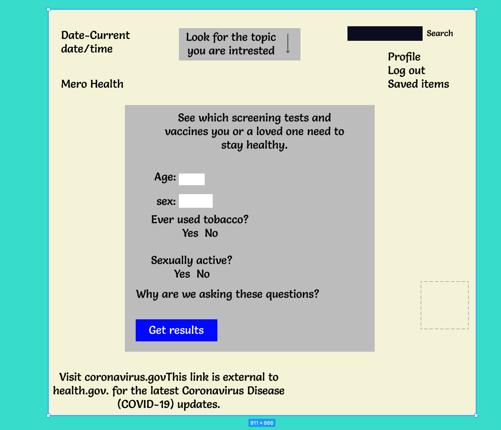

# My-Health

<h2>OVERVIEW<h2>

My-Health is based on our health and various other health topic related app which gives us many information on various topics you want on your health.

<h2>Discription<h2>
My-Health app is very user friendly with clear cristal features and informative display .
User are required to sign up and fill necessary information about yourself to get all of the app features.After signing up everytime user can save the required information on their profile for future use .They can even search for the healthcare facilities near them with the information they added on their profile. 

<h2>MVP Goals</h2>

Here is the brief discription and features of how this app works.
<li>you can excess thousand of topic and sub-topic related to your health queries.
<li>You/User can make a profile and save your queries and information for your future references.
<li>You/user can share the information to other 
<li>you can create your health profile b entering your full information
<li>With your given information app can recommend you vaious health information as well as display you your nearest healthcare facilities.

<h2>Stretch Goals<h2>

<ol>
<li>Work on CSS and try to make it look more professional </li>
<li>Add second language (spanish) so that non english speaker can interact with the app</li>
<li>User can also connect via facebook /instagram</li>
<li>Send email notification on various health information, tips and tricks.
<li>Forget Password or reseting the password if user forget their passwword</li>

<h2>DAILY SPRINTS<h2>
<ul>
<ol>Monday

<li>Wireframe app(Using link below)</li>
<li>draw an ERDs</li>
<li>CRUDs,planning routes</li>
<li>start working on main page(create an account/store the mail,username and password to db)</li>
    </ol>

<ol>Tuesday
<li>create db models -- test db</li>
<li>stub routes -- test routes</li>
<li>build routes</li>
</ol>

<ol>Wednesday
<li>finish routes</li>
<li>create views</li>
</ol>

<h2>User Stories<h2>
Me as a user i want the app to be very easy to access and very self explanatory to the users. Here are the few user story for this app below.

<li>As a user i should log in and out with my secure password.
<li> AS a user i could easily access my profile and delete or update or create my profile anytime.
<li>User can reset password if they forget the password.
<li>User personal information will not be used for any purpose at all.
<li>User can share the information aquire from the app.

<h2>API INFORMATION</h2>
My-health is using <a href='https://health.gov/our-work/health-literacy/consumer-health-content/free-web-content/apis-developers/documentation'>API LINK INFO!</a> api which is very much developers friendly and tons of information related to the given topic.For more information please visit the link I posted above.

<h2>WIREFRAMES<h2>

 

 

<h2>CRUDs</h2>
<ul>
Post/POST
</ul>
<li>user account(user email,password)</li>
<ul>
Read/GET
</ul>
<li>main index page</li>
<li>account create page</li>
<li>saved item page</li>
<li>user profile page</li>

<ul>
Update/POST
</ul>
<li>user can update the form of recommondation</li>
<li>user can update account password</li>

<ul>
<li>user can remove the saved file from the profile</li>
<li>user can also remove all the data and information from the database</li>

